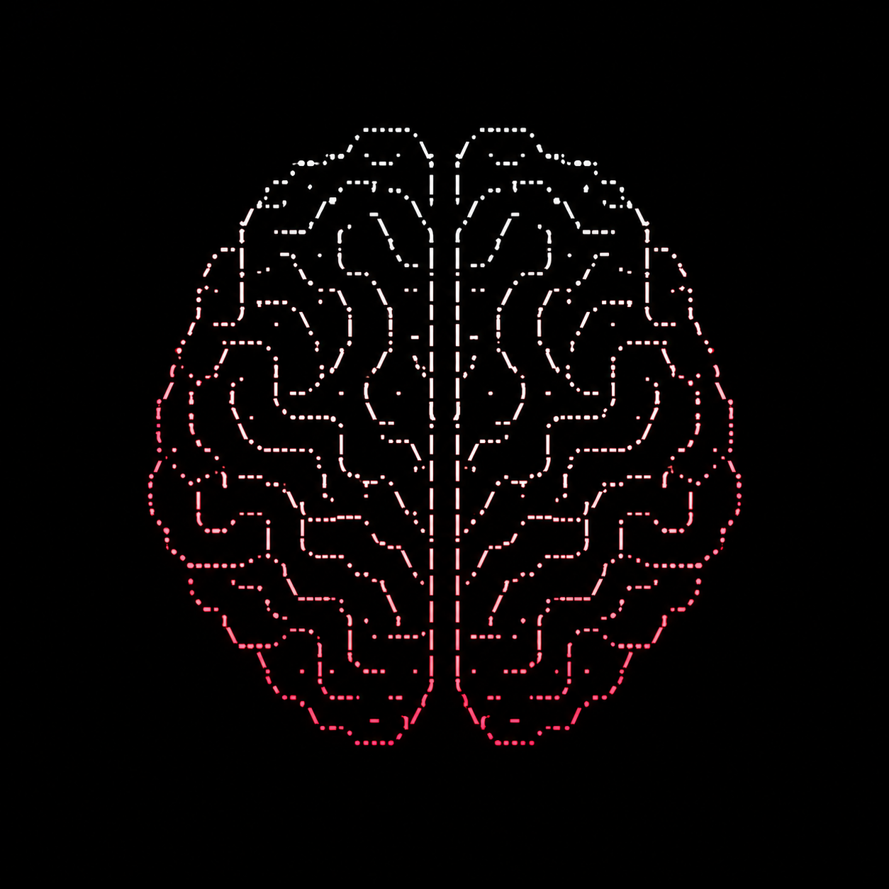
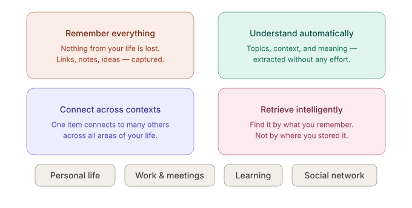

# nibame

<p align="center">
  
</p>

<p align="center">
  <a href="https://discord.gg/jfj7tSQRU5">
    
  </a>
</p>

> **Your life (Personal & Work). Connected. Searchable. Remembered.**

We save reels, DM ourselves links, and bookmark things we swear we'll come back to. We never do and when we actually need something, it's buried under hundreds of other saves across a dozen different apps, with no way to connect any of it. nibame is a unified context layer for your life: one place that captures everything across your personal world, work, learning, and people and brings the right thing back when it actually matters.

<p align="center">
  
</p>

## Current foundation: URL organization

The first working vertical slice is a deterministic URL categorizer. It identifies a
link's platform family from local domain, path, and file rules without fetching the page
or calling an AI service.

```text
backend/   FastAPI API, category rules, and manual overrides
frontend/  Next.js capture interface with category correction
```

No database is required. Curated rules live in `backend/category_rules.json`; optional
manual corrections are stored in `backend/data/user_patterns.json`.

### Run locally

Backend:

```bash
python3 -m venv backend/.venv
backend/.venv/bin/pip install -r backend/requirements.txt
backend/.venv/bin/uvicorn backend.main:app --reload --port 8000
```

Frontend, in a second terminal:

```bash
cd frontend
npm install
npm run dev -- --port 3002
```

Open `http://localhost:3002`.

Sooo, 
**nibame** is personal context engine (basically an organized database).

## Before we begin this readme
My personal note - I'm Harsh Mehta, this readme was my memory dump that i shared with claude and it has converted into a structured format. Before you hop on to the AI generated things, I wanted to share some handwritten thoughts. 

[ Note as of 16th sept - I dont mean for this proj to be some repo / github farming slop. I also dont intend for this to be some second brain bs. Its just an idea or gutt feeling i had or maybe an urge to have a project like this. I discussed this idea with some of my friends and they gave a lot of critical feedback on it which makes sense. The project does not have clear definitions yet and I (we) really need to handle this with extreme caution or this project will end up becoming another random productivity app that we download and dont use ] 

My main wish is to have 4 main parts of this project working which we all can use in our lives. 

- 1. Personal life links and context (todo, goals, habits, anything else) dump
- 2. Work life context, meetings, notes, todo, etc
- 3. Personal network graph like thing with a LOT of filters. I wanna make a system which can visualize personal network of network of communities (eg an OSS community's graph where we can all have a fun visualization of the same). I hope you get the point. 
- 4. This is the 4th point but the first most important thing, to have a very robust system design for this. Through this project I want to learn more things with depth and become a better engineer. That said i also want my fellow friends, juniors and folks get started with OSS in general or grow at it.

Join the discord - https://discord.gg/jfj7tSQRU5

To reach out to me, or for my personal info u can check my linkedin and github profile.


--- 

It gives you one place to capture, organize, connect, and retrieve the information that matters across your personal life, work, learning, relationships, and everything in between.

---

## Index

* [1. What is nibame?](#1-what-is-nibame)
* [2. The Problem](#2-the-problem)
* [3. The Core Idea](#3-the-core-idea)
* [4. How nibame Thinks About Your Life](#4-how-nibame-thinks-about-your-life)
* [5. Capture Everything](#5-capture-everything)
* [6. Memory and Context](#6-memory-and-context)
* [7. Ask Your Brain](#7-ask-your-brain)
* [8. Intelligence and Connections](#8-intelligence-and-connections)
* [9. Personal Layer](#9-personal-layer)
* [10. Social and Professional Network](#10-social-and-professional-network)
* [11. Work Layer](#11-work-layer)
* [12. Link Intelligence and Inbox](#12-link-intelligence-and-inbox)
* [13. Location Intelligence](#13-location-intelligence)
* [14. UI Philosophy](#14-ui-philosophy)
* [15. Product Principles](#15-product-principles)
* [16. Technical Product Definition](#16-technical-product-definition)
* [17. Architectural North Star](#17-architectural-north-star)
* [18. Development Direction](#18-development-direction)
* [19. The Core Test](#19-the-core-test)

---

# 1. What is nibame?

The name **nibame** comes from the Japanese word for "second".

The idea is simple:

> **nibame is the a database system that remembers, understands, and connects the things your real brain comes across every day.**

Today, information about our lives is scattered across dozens of different places:

* YouTube Watch Later
* Instagram saved posts and reels
* X/Twitter bookmarks
* GitHub repositories
* Browser bookmarks
* Notes
* Notion
* Task managers
* Calendars
* Meeting notes
* Contacts
* Screenshots
* Documents
* Reminders
* Our own memory

The problem is not that these tools do not exist.

The problem is that **there is no unified context layer connecting all of them.**

nibame aims to become that layer.

---

# 2. The Problem

We constantly come across things that we want to remember or come back to later.

A YouTube playlist we want to learn from.

A GitHub repository that could be useful for a future project.

An Instagram reel showing a place we want to visit.

A person we met who works at an interesting company.

A technical article we want to read.

A random idea we do not want to forget.

A task we need to finish.

A thought from a meeting.

A conversation we had months ago.

We usually save all of these things, but saving something is not the same as remembering it.

Months later, we might know that we saved something, but not:

* where we saved it
* why we saved it
* what it was related to
* what else we knew about the same topic
* whether it is still relevant

nibame is built around solving this problem.

---

# 3. The Core Idea

The fundamental interaction should be extremely simple:

> **"I want my brain to remember this."**

You should be able to throw almost anything into nibame without first deciding where it belongs.

For example, you save a YouTube video about distributed systems.

Instead of simply storing:

```text
YouTube
  └── Video
```

nibame should eventually understand something more like:

```text
Distributed Systems
       |
       +---- Learning
       |
       +---- Backend Engineering
       |
       +---- Kafka
       |
       +---- Current Interests
```

It could also connect that video to:

* another GitHub project you saved earlier
* a course you are currently taking
* notes you wrote about Kafka
* a work problem related to distributed systems
* people in your network who work in this area
* tasks related to learning the topic

This connection between pieces of information is what makes nibame a **unified layer**, rather than another bookmarking or note-taking app.

---

# 4. How nibame Thinks About Your Life

Internally, nibame can be thought of as four interconnected layers:

```text
                         +----------------------+
                         |        NIBAME        |
                         |    Personal Context  |
                         |         Engine       |
                         +----------+-----------+
                                    |
              +---------------------+---------------------+
              |                     |                     |
              v                     v                     v
       +-------------+       +-------------+       +-------------+
       |   PERSONAL  |       |    WORK     |       |  LEARNING   |
       +-------------+       +-------------+       +-------------+
       | Tasks       |       | Meetings    |       | Courses     |
       | People      |       | Projects    |       | Videos      |
       | Places      |       | Documents   |       | Articles    |
       | Journal     |       | Decisions   |       | Projects    |
       +-------------+       +-------------+       +-------------+
              \                     |                     /
               \                    |                    /
                +-------------------+-------------------+
                                    |
                                    v
                         +----------------------+
                         |        MEMORY        |
                         |         GRAPH        |
                         +----------+-----------+
                                    |
                                    v
                         +----------------------+
                         |    INTELLIGENCE      |
                         | Search / Retrieval   |
                         | Connections / AI     |
                         | Recommendations      |
                         +----------------------+
```

These are internal concepts, not necessarily separate sections that the user has to navigate through.

The goal is still **one brain**.

---

# 5. Capture Everything

Capture should be the most important interaction in nibame.

The user should not have to think:

> "Should I put this in my notes, bookmarks, tasks, or learning database?"

Instead:

> **Capture it. nibame will figure it out.**

Potential inputs include:

* URLs
* YouTube videos
* YouTube playlists
* Instagram reels and posts
* X/Twitter posts
* GitHub repositories
* Articles
* Documents
* Images
* Screenshots
* Text
* Ideas
* Tasks
* Reminders
* People
* Locations
* Voice notes
* Meeting notes
* Journal entries

The capture process should require almost no effort.

---

# 6. Memory and Context

This is the heart of nibame.

Instead of organizing everything purely into folders and pages, nibame should represent information as **entities and relationships**.

Possible entities include:

```text
Person
Company
Place
Project
Task
Event
Meeting
Document
Video
Article
Repository
Idea
Topic
Skill
Course
Journal Entry
Bookmark
```

These entities can have relationships with each other.

For example:

```text
Person -------- works_at --------> Company
Person -------- knows -----------> Person
Person -------- lives_in ---------> Place

Video --------- about ------------> Topic
Video --------- related_to -------> Project
Repository ---- implements -------> Concept

Task ---------- belongs_to -------> Project
Meeting ------- discussed ---------> Project
Meeting ------- with -------------> Person
Meeting ------- created ----------> Task

Journal ------- mentions ---------> Person
Journal ------- mentions ---------> Topic
```

This is where a graph database such as **Neo4j** becomes interesting.

The graph should not exist just because a graph visualization looks cool.

It represents something fundamental:

> **Your life is naturally a graph of people, places, ideas, projects, experiences, and relationships.**

The graph is the underlying memory structure. The UI is simply one way of exploring it.

---

# 7. Ask Your Brain

Storing information is only half the problem.

The more important question is:

> **Can I find it when I need it?**

You should not have to remember where you stored something.

You should be able to ask nibame naturally:

```text
"What were those distributed systems projects I saved?"

"What did I want to learn about Kafka?"

"What restaurants did I save in Mumbai?"

"Who do I know at Google?"

"Who do I know in Bangalore?"

"What did I discuss with this person last month?"

"Show me everything related to my GSoC project."

"What things have I saved but never looked at?"
```

The system should combine multiple forms of retrieval:

```text
Natural Language Query
          |
          v
 Intent + Entity Extraction
          |
          +-------------------+
          |                   |
          v                   v
    Graph Queries       Semantic Search
          |                   |
          +---------+---------+
                    |
                    v
             Personal Context
                    |
                    v
                  Answer
```

Eventually, this becomes a way of **talking to your own memory**.

---

# 8. Intelligence and Connections

This is where nibame should eventually become more than a storage system.

It should be able to identify useful connections that the user did not explicitly make.

For example:

> You saved seven resources about distributed systems over the last three months.

Or:

> You have four saved resources about Kafka, and two are related to a project you worked on recently.

Or:

> You are visiting Mumbai. You have twelve saved places in Mumbai.

Or:

> You have three professional connections who work at companies you are interested in.

Or:

> You have mentioned wanting to learn Kubernetes several times, but have never created a learning task for it.

The goal is not to constantly interrupt the user with AI-generated suggestions.

The goal is to **surface useful context at the right time**.

---

# 9. Personal Layer

The personal layer covers everything outside day-to-day work.

### Knowledge and Learning

* Things to learn
* Books
* Videos
* Articles
* Courses
* Projects
* Ideas
* Technical topics
* Skills

### Personal Life

* Tasks
* Reminders
* Goals
* Journaling
* Habits
* Travel
* Places
* Experiences

### Social

* People
* Relationships
* Companies
* Locations
* Professional connections

The important part is that these should not become isolated databases.

They should connect back to the same underlying memory.

---

# 10. Social and Professional Network

One particularly interesting part of nibame is the personal network graph.

The system could represent people and their relationships like:

```text
                         Me
                          |
              +-----------+-----------+
              |                       |
              v                       v
          Person A                 Person B
              |                       |
              v                       v
         works_at                  works_at
              |                       |
              v                       v
           Google                  Microsoft
              |
              v
         Bangalore
```

Over time, this can become a useful personal intelligence layer.

For example:

```text
"Who do I know at Google?"

"Who do I know in Bangalore?"

"Who knows someone at this company?"

"Who from my network lives in Mumbai?"

"Which people I know work in AI?"

"Who could potentially help me with a referral?"
```

The system could also track relevant context about relationships and interactions.

This is intended to be a **private personal network**, not a public social network.

---

# 11. Work Layer

Work should have its own logical context while still using the same underlying memory engine.

It can include:

* Projects
* Meetings
* Minutes of meeting
* Work tasks
* Questions
* Follow-ups
* Decisions
* Deadlines
* Documents
* People
* Calendar
* Schedule
* Project context

A meeting should not just be a standalone note.

It could become:

```text
Meeting
  |
  +---- with ------> Person A
  |
  +---- discusses -> Project X
  |
  +---- creates ---> Task Y
  |
  +---- raises ----> Question Z
  |
  +---- makes -----> Decision D
```

This enables questions such as:

> "Why did we choose this architecture?"

Instead of searching through old meeting notes, nibame could trace the relevant project, decision, discussion, and people involved.

That is much closer to how human memory works.

---

# 12. Link Intelligence and Inbox

A universal **Inbox** should be the default landing zone for captured content.

Everything can initially arrive there.

The system can then analyze it and suggest structure.

For example:

```text
Captured:
YouTube video

        |
        v

Detected:
Topic: Distributed Systems
Intent: Learning
Concepts: Kafka, Event Streaming

        |
        v

Suggested Connections:
Backend Engineering
Current Learning Goals
Related Projects
```

The user can then:

* accept the suggestion
* modify it
* reject it
* add additional context

Over time, nibame could learn how the user tends to organize information.

The important part is that **organization happens after capture**, not before it.

---

# 13. Location Intelligence

Location is one example of how context can make stored information useful at the right moment.

Suppose you save an Instagram reel about places to visit in Mahabaleshwar.

nibame can identify:

```text
Content
  |
  +---- Type: Instagram Reel
  |
  +---- Topic: Travel
  |
  +---- Location: Mahabaleshwar
```

Later, when you are planning or taking a trip to Mahabaleshwar, nibame can surface:

```text
MAHABALESHWAR

Places you saved:
- Place A
- Place B
- Place C

Saved content:
- 4 Instagram reels
- 2 YouTube videos
- 3 restaurants
```

The same idea can work for Mumbai, Bangalore, Delhi, or anywhere else.

Location intelligence is not the core of nibame, but it is a good example of what becomes possible once information is connected.

---

# 14. UI Philosophy

This part is extremely important.

nibame should **not become another Notion**.

The user should not have to navigate through:

```text
Dashboard
  |
  +-- Notes
  +-- Tasks
  +-- Projects
  +-- Bookmarks
  +-- People
  +-- Journals
  +-- Calendar
  +-- Work
  +-- Learning
  +-- ...
```

That creates the same problem we are trying to solve.

The interface should feel like one unified brain.

A possible starting point:

```text
+------------------------------------------------+
|  Search your brain...                      K  |
+------------------------------------------------+
|                                                |
|                  YOUR CONTEXT                  |
|                                                |
|             o--------o                         |
|           / |        |\                        |
|          o  o--------o o                       |
|           \ |       /                          |
|            o-------o                           |
|                                                |
|                                                |
+------------------------------------------------+
|   + Capture        Today        Inbox          |
+------------------------------------------------+
```

The graph can be an important visual representation, but it should not be the only way to use the product.

The primary interactions should be:

### Capture

Put something into your brain.

### Search

Find something you already know exists.

### Explore

Follow connections and discover context.

### Ask

Use natural language to interact with your memory.

---

# 15. Product Principles

### 1. Capture everything

Do not make the user decide where something belongs before saving it.

### 2. Structure automatically

Extract entities, topics, locations, dates, intent, and relationships automatically.

### 3. Context over folders

Connect information instead of burying it inside isolated pages.

### 4. Retrieval over organization

Users should be able to find information based on what they remember, not where they stored it.

### 5. One brain, multiple contexts

Personal, work, learning, and social information should share a common context engine while remaining logically separable.

### 6. AI assists, the user owns the memory

AI should help organize, summarize, connect, and retrieve information. The underlying data should remain under the user's control.

### 7. Zero-friction UX

Capturing something should take seconds.


Privacy and security therefore need to be architectural principles, not features added later.

### 8. Open source

Users should be able to inspect the system, self-host it, and maintain control over their own data. Anybody can freely use it, in a non commercial way.  (I dont even know if this project will finish as intended so commercial stuff is just some bs , as if somebody would use it as of sept 2026 lmao )


---

# 17. Architectural North Star

The system should eventually follow this conceptual pipeline:

```text
                 +----------------------+
                 |        INPUT         |
                 |                      |
                 | URL / Text / Task /  |
                 | Person / Journal /   |
                 | File / etc.          |
                 +----------+-----------+
                            |
                            v
                 +----------------------+
                 |      INGESTION       |
                 |                      |
                 | Extract              |
                 | Normalize            |
                 | Classify             |
                 | Identify Entities    |
                 | Generate Metadata    |
                 +----------+-----------+
                            |
                            v
                 +----------------------+
                 |       MEMORY         |
                 |                      |
                 | Graph                |
                 | Semantic Data        |
                 | Metadata             |
                 +----------+-----------+
                            |
                            v
                 +----------------------+
                 |    INTELLIGENCE      |
                 |                      |
                 | Search               |
                 | Retrieval            |
                 | Summarization        |
                 | Connections          |
                 | Recommendations      |
                 +----------+-----------+
                            |
                            v
                 +----------------------+
                 |     INTERFACE        |
                 |                      |
                 | Capture              |
                 | Search               |
                 | Explore              |
                 | Ask                  |
                 +----------------------+
```

Neo4j could be a strong candidate for the graph component, but **Neo4j is not the product**.

The graph is one part of the memory layer.

The actual product is the complete:

```text
Capture
   |
   v
Understand
   |
   v
Connect
   |
   v
Remember
   |
   v
Retrieve
   |
   v
Act
```

loop.

---

# 18. Development Direction

The full vision is intentionally broad.

It would be a mistake to try to build the entire "life operating system" in the first version.

Instead, the architecture should support the long-term vision while development starts with a small, complete vertical slice.

The planned progression is:

1. Define functional requirements.
2. Define non-functional requirements such as privacy, latency, scalability, offline behavior, and self-hosting.
3. Define the core entities and relationships.
4. Define the MVP boundary.
5. Design the high-level system architecture.
6. Design the low-level data model and storage strategy.
7. Design the AI ingestion, extraction, classification, and retrieval pipeline.
8. Design the minimal, low-clutter UX.
9. Design the open-source and self-hosting architecture.
10. Build the first vertical slice.

The first vertical slice should be:

```text
Capture a link
      |
      v
Understand it
      |
      v
Store it
      |
      v
Connect it
      |
      v
Retrieve it intelligently
```

If this works well, we have validated the fundamental idea behind nibame.

Tasks, calendars, meetings, social graphs, journaling, location intelligence, and other capabilities can then be built on top of the same foundation.

---

# 19. The Core Test

The simplest way to judge whether nibame is actually working is this:

> **Can I stop thinking about where information belongs and start trusting nibame to remember it, connect it with the right context, and bring it back when it becomes useful?**

If the answer is yes, nibame is doing what it is supposed to do.

That is the fundamental difference between nibame and a conventional notes, bookmarks, or productivity application.

**nibame is not meant to be another place where you store your life.**

It is meant to become the place that **understands your life.**
